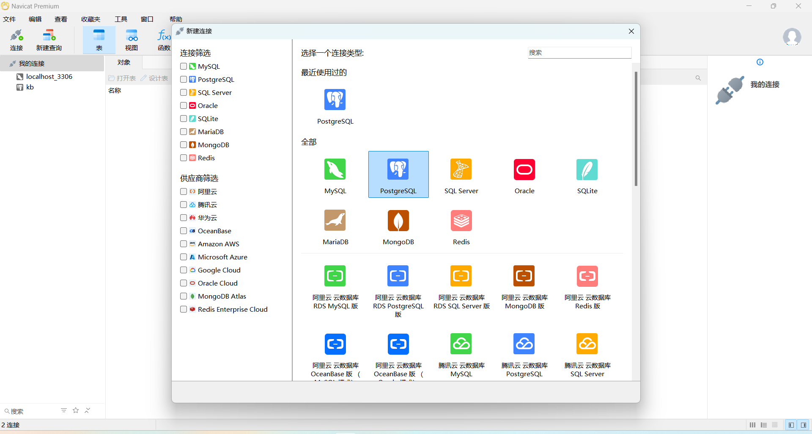
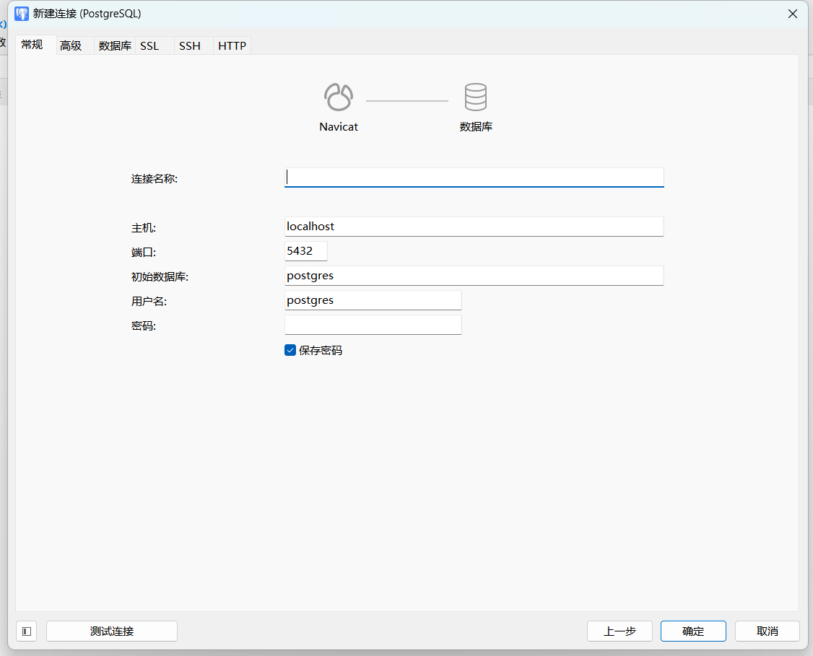
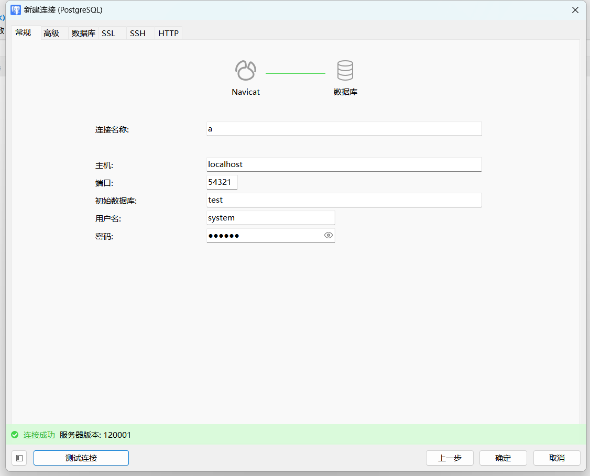
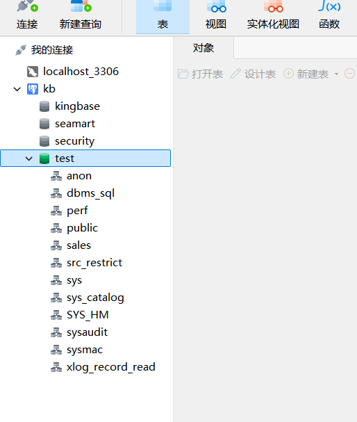
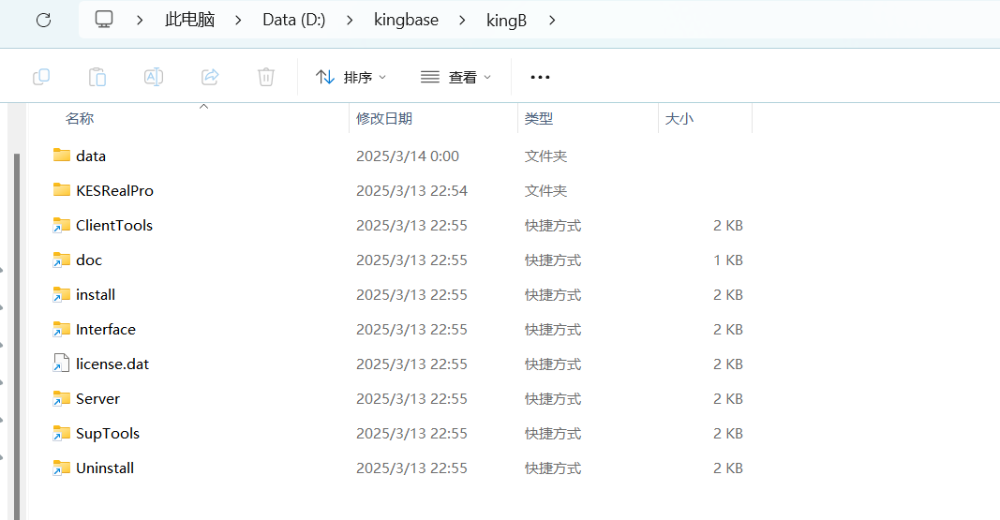
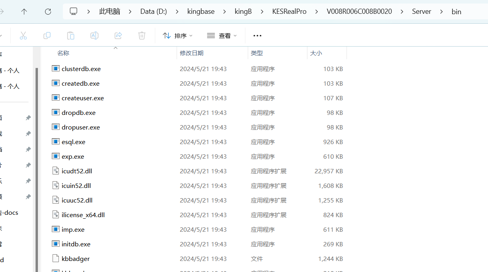
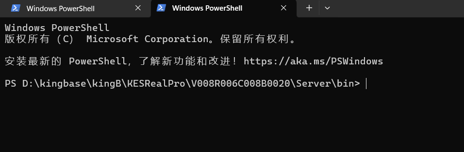
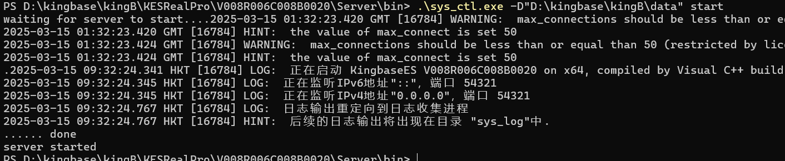

# 连接数据库

## 本节目录

- [连接数据库](#连接数据库)
  - [本节目录](#本节目录)
  - [使用 Navicat 连接金仓数据库](#使用-navicat-连接金仓数据库)
    - [背景知识](#背景知识)
    - [连接步骤](#连接步骤)
    - [完成标志](#完成标志)
    - [常见 Q \& A](#常见-q--a)
      - [因为数据库未打开，连接失败](#因为数据库未打开连接失败)

## 使用 Navicat 连接金仓数据库

接下来，我们将介绍如何使用 Navicat 这一强大的数据库连接工具来连接金仓数据库。请确保您已经安装了 Navicat 并激活了正版授权，以便顺利执行以下步骤。

### 背景知识

如文章：[https://www.zhihu.com/question/582960448]() 所介绍的，金仓可以视作一个闭源的 `PostgreSQL`，因此我们使用 Navicat 连接金仓数据库时，需要使用 `PostgreSQL` 的连接方式。

### 连接步骤

1. 打开 Navicat，点击左上角的 `连接` 按钮，选择 `PostgreSQL`，之后点击右下角的 `下一步`。
   
2. 在弹出的窗口中，填写连接信息，包括：
   
   - `连接名称`：自定义，用于标识该连接。
   - `主机`：由于是本机部署，因此填写 `localhost`。
   - `端口`：金仓数据库默认端口为 `54321`。我们之前的[环境搭建章节](./kb-deploy.md#图形化安装)也是填写的这个端口。
   - `初始数据库`：填写 `test`，这是金仓数据库的默认数据库，之前也配置过。
   - `用户名`：填写 `system`，这是金仓数据库的默认用户名，之前也配置过。
   - `密码`：之前配置的 `123456`。
3. 然后我们需要先点击左下角的 `测试连接` 按钮，确保连接信息正确。
   
4. 测试连接成功后，点击右下角的 `确定` 按钮，完成连接的创建。
5. 若连接不成功，可以尝试按照[常见 Q & A](#常见-q--a) 中的方法解决。

### 完成标志

双击 / 右键点击 `Navicat` 左侧的 `连接名称`，如果能够进行展开，并看到其内的 `test` 数据库和其它的系统自带的数据库，则说明连接成功。如下图：

**PS：图里面的 `seamart` 数据库是后续建立的，没有是正常情况。**

### 常见 Q & A

#### 因为数据库未打开，连接失败

在连接过程中，可能出现连接失败，这时候可能是因为数据库还未打开，如果出现这种情况，请先打开金仓数据库，再重新尝试连接。

解决方案如下：

1. 到金仓数据库的安装路径内，如：
   
2. 选择 `Server` 这个快捷方式，进入到 `Server` 的 `bin` 目录，如：
   
3. 打开命令行(我使用的是 `Powershell`)并进入到 `bin` 目录，如：
   
4. 输入命令：`./system_ctl.exe -D 你的数据目录 start`，这里提到的 `你的数据目录`，就是在之前环境配置里配过的内容，如果用的是默认的，那就在你的安装目录里的 `data` 目录内。如图所示：
   

预期如下所示：

然后，回到 Navicat，重新点击 `测试连接`，如果连接成功，则可以正常连接金仓数据库。
