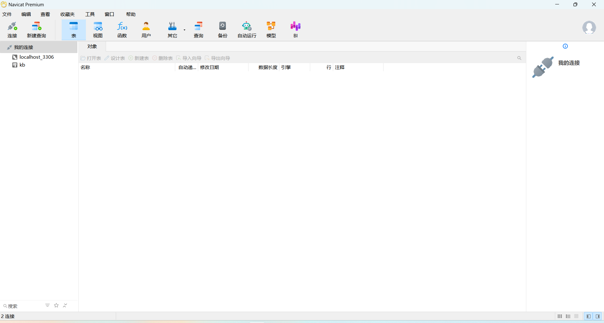

# 环境准备 - 数据库连接工具

在现代化的软件开发和维护过程中，数据库扮演着至关重要的角色。为了更高效、更安全地管理和操作数据库，我们通常不会直接在数据库服务器上执行命令，而是通过专业的数据库连接工具来进行。这些工具提供了友好的用户界面、便捷的操作方式以及强大的功能支持。

## 本节目录

- [环境准备 - 数据库连接工具](#环境准备---数据库连接工具)
  - [本节目录](#本节目录)
  - [环境准备 - 数据库连接工具 Navicat](#环境准备---数据库连接工具-navicat)
    - [有课程资料包](#有课程资料包)
    - [无课程资料包](#无课程资料包)
    - [注意事项](#注意事项)
    - [完成标志](#完成标志)
  - [强调项](#强调项)

## 环境准备 - 数据库连接工具 Navicat

Navicat 是一款广受欢迎的数据库管理工具，它支持多种数据库系统，如 MySQL、MariaDB、MongoDB、SQL Server、Oracle、PostgreSQL 以及 SQLite 等。Navicat 提供了强大的数据库管理功能，包括数据库开发、数据同步、结构管理、数据导入/导出等。需要注意的是，Navicat 是一款收费的正版软件，我们强烈建议用户购买正版以获得最佳的使用体验和售后服务。

### 有课程资料包

如果您已经获得了课程资料包，那么您可以直接使用包内提供的 Navicat 安装程序。请按照以下步骤进行操作：

1. 解压课程资料包，找到 Navicat 安装程序。
2. 阅读其内的 `准备Navicat/操作流程.txt` 文档。
3. 双击安装程序，开始安装过程。
4. 在安装过程中，请确保遵循屏幕上的提示进行操作，并同意软件许可协议。

### 无课程资料包

如果没有得到资料包，请自行下载 Navicat，下载地址为：https://www.navicat.com.cn/download/navicat-premium。

下载步骤如下：

1. 访问 Navicat 官方下载页面：https://www.navicat.com.cn/download/navicat-premium
2. 选择适合您操作系统的版本进行下载。
3. 下载完成后，运行安装程序。
4. 安装过程中，您将需要同意软件许可协议。请仔细阅读协议内容，了解您的权利和义务。
5. 按照安装向导的提示完成安装步骤。安装完成后，您将需要购买并输入正版授权信息来激活软件。

### 注意事项

在安装 Navicat 的过程中，以下是一些额外的建议和注意事项：

- 确保您的计算机满足 Navicat 的系统要求。
- 在安装过程中，您可以选择自定义安装路径和功能组件。
- 安装完成后，您可以创建桌面快捷方式，以便快速访问 Navicat。
- 如果您在安装过程中遇到任何问题，可以参考 Navicat 官方提供的安装指南或者联系技术支持。

### 完成标志

通过以上步骤，应该能够成功安装并开始使用 Navicat，从而更加高效地管理和操作您的数据库。我们可以打开 Navicat 来验证此环境已经准备完毕，在打开 Navicat 后，应该能够看到如下主界面，作为完成环境准备的一个标志：

**注：新打开的 Navicat 窗口的左边栏部分，可能显示为空，这是因为尚未连接过任何数据库。**

## 强调项

**再次强调，为了支持软件开发者的劳动成果，请使用正版软件。**
