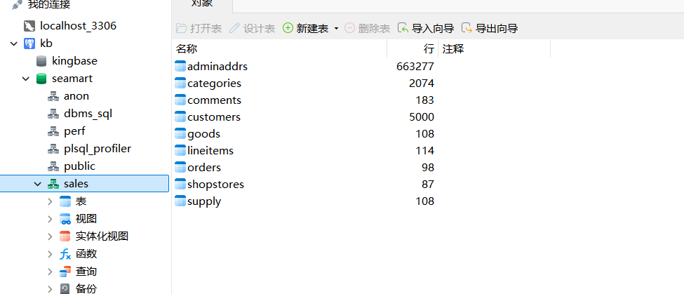

# 数据加载

本部分将介绍如何将**课程资料包**内的数据加载到金仓数据库中。若无课程资料包，请自行获取。作者无权也不会提供课程资料包。

## 本节目录

- [数据加载](#数据加载)
  - [本节目录](#本节目录)
  - [背景知识简介](#背景知识简介)
    - [SQL 脚本](#sql-脚本)
    - [分析型数据库 PostgreSQL](#分析型数据库-postgresql)
    - [数据库模型](#数据库模型)
    - [绝对路径 和 相对路径](#绝对路径-和-相对路径)
  - [实际操作](#实际操作)
  - [完成标志](#完成标志)
  - [强调项](#强调项)

## 背景知识简介

### SQL 脚本

在数据迁移的过程中，一种常见的解决方案是将数据从源数据库导出为 SQL 脚本，随后在目标数据库中执行该脚本以实现数据的迁移。

SQL 脚本实质上是一系列 SQL 语句的集合，这些语句负责创建表格、插入数据、更新记录、删除记录等操作。当执行 SQL 脚本时，数据库管理系统会按照脚本文件中的顺序逐条执行这些语句，从而完成数据的迁移工作。

### 分析型数据库 PostgreSQL

数据库系统根据其设计目的和应用场景的不同，可以分为多种类型。例如，MySQL 数据库主要用于处理在线事务处理（OLTP）任务，而 PostgreSQL 则专为在线分析处理（OLAP）而设计，适用于数据分析场景。数据库还可以根据数据模型的不同，分为关系型和非关系型两大类。

PostgreSQL 是一款功能强大的开源分析型数据库，金仓数据库与其类似，同样属于分析型数据库。这类数据库的主要特点是更加侧重于数据分析。本课程资料包中的 Seamart 数据集即是源自金仓数据库，专为分析目的而设计的。

### 数据库模型

数据库系统在架构上可以类比于一款 Web 应用。正如 Web 应用包含前端和后端，前端负责用户界面的展示和数据交互，后端则处理逻辑和存储数据。类似地，数据库系统也可以分为前端和后端。数据库的前端通常负责数据的展示和收集，而后端则由数据库管理员负责维护，确保数据的安全性和完整性。

### 绝对路径 和 相对路径

绝对路径是指从根目录开始的完整路径。它不依赖于当前的工作目录，因此总是指向同一个位置，无论当前的工作目录在哪里。绝对路径通常以斜杠 / 开头。例如，要访问 `C:\user\documents\reports`，绝对路径就是 `C:\user\documents\reports`。

相对路径是指从当前工作目录开始的路径。它依赖于当前的工作位置，因此当工作目录改变时，相对路径也会随之改变。使用相对路径的好处是它更加灵活。例如，如果当前目录是 `C:\user\documents\`，而您想要访问 `C:\user\documents\reports`，相对路径可以简单地写作 `.\reports`。

至于说 windows 系统内如何查看文件的绝对路径，这个自行学习吧...

## 实际操作

既然我们需要对数据库进行操作，那肯定是用管理员端最轻松了，所以首先进到管理员端，然后我们就可以开始操作了。

1. 到金仓数据库的安装路径内，如：
   
2. 选择 `Server` 这个快捷方式，进入到 `Server` 的 `bin` 目录，如：
   
3. 打开命令行(我使用的是 `Powershell`)并进入到 `bin` 目录，如：
   
4. `bin` 目录内，我们需要增加数据，需要使用 `ksql.exe` 来执行 SQL 脚本，到官网可以查到它的用法，我们需要的内容如下：
   - `-f`：指定要执行的 SQL 脚本文件。
   - `-U`：指定以什么人登录。
   - `-d`：指定要连接的数据库。
     > 可以看到，我们在读入数据时，是需要先指定数据库的，但数据库哪来的呢？我们可以看到，课程资料包内的 `seamart数据集` 目录下有两个 SQL 脚本，分别是 `DDL.sql` 和 `seamart.sql`，我们需要先执行 `DDL.sql` 创建数据库，再执行 `seamart.sql` 为新建的数据库添加数据。
5. 执行 `DDL.sql`，如：`./ksql.exe -Usystem -dtest -f DDL.sql的路径`。`DDL.sql` 的路径需要自行填写其**绝对路径**。
6. 执行 `seamart.sql`，如：`./ksql.exe -Usystem -dseamart -f seamart.sql的路径`。`seamart.sql` 的路径需要自行填写其**绝对路径**。

理论上来说，这样就可以把数据导入到数据库中了。

**PS：不是说相对路径不好使，只是说绝对路径方便且不易写错。**

## 完成标志

使用 `Navicat` 连接 `kingbase`，能够在其内看到 `seamart` 数据库，打开后发现其内存在 `sales` 表，如：

## 强调项

- 请注意脚本执行顺序！

- Navicat 在运行 SQL 脚本时，会按照顺序，**交由实际的数据库**执行 SQL 语句，所以，它的执行效果可以视作每一行都是在进行一次事务的 commit，所以，一旦运行过程中出现错误，那么，在错误发生之前的所有操作并不会被回滚。所以这时候，最好把出错的那个数据库**删掉**之后，再**重新开始导入**。不然会出现很多奇奇怪怪的问题。

  > PS：删除数据库最简单的方法是在 `Navicat` 里直接右键点击该数据库然后选择`删除`，但需要注意一点，`Navicat` 在做这种基于数据库的操作时，完成后最好关掉这个连接，然后重新打开连接(没错，就是手动刷新！)，以防出现奇奇怪怪的问题。

- 虽说我应该是踩过坑了，但我仍然不想复现那些奇奇怪怪的问题，故在此处就不写那部分的内容了。
