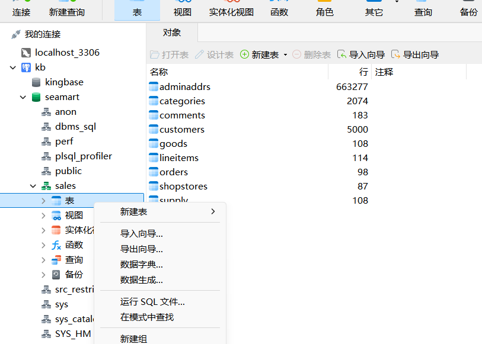
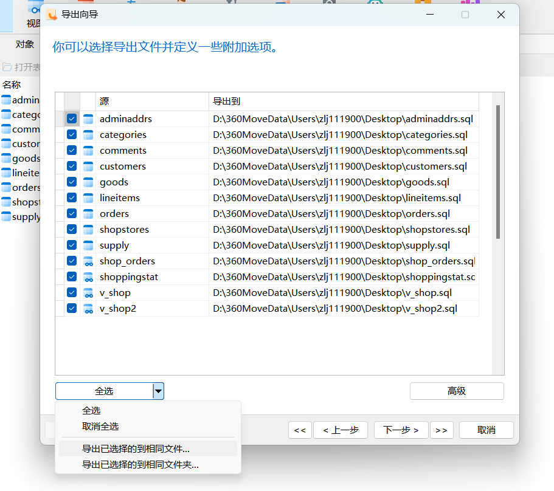
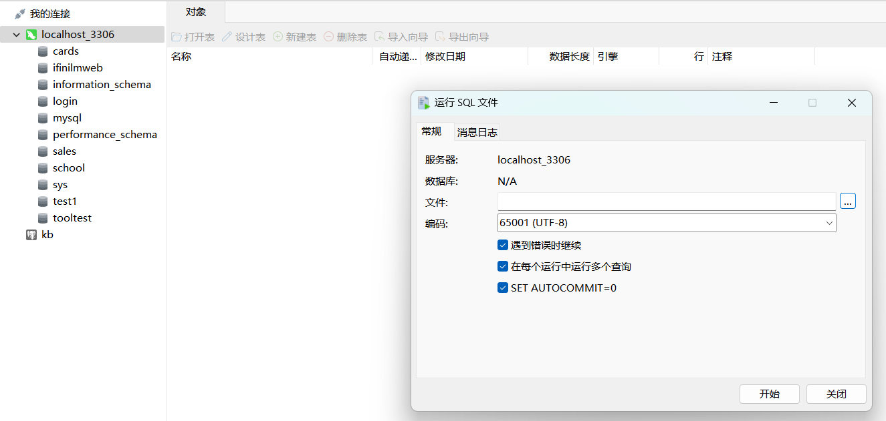
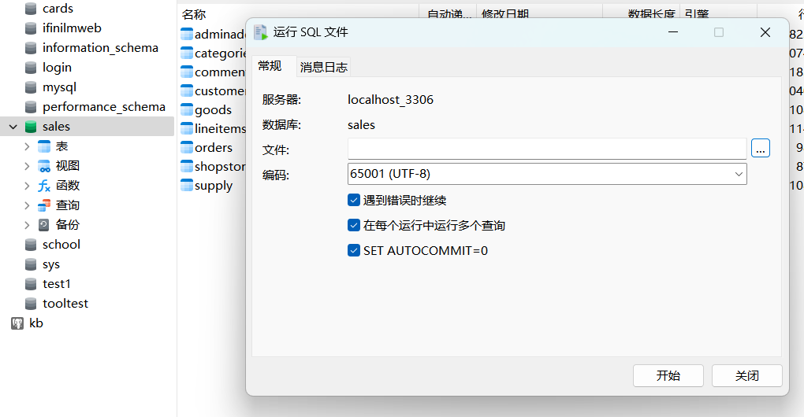

# 数据迁移

本部分预计记录将金仓里的数据迁移至 MySQL 的流程。

## 本节目录

- [数据迁移](#数据迁移)
  - [本节目录](#本节目录)
  - [大体流程介绍](#大体流程介绍)
  - [数据导出](#数据导出)
    - [背景](#背景)
    - [Navicat 导出流程](#navicat-导出流程)
  - [适配性修改](#适配性修改)
    - [1. 修改列名和表名](#1-修改列名和表名)
    - [2. 为 DDL.sql 做适配](#2-为-ddlsql-做适配)
    - [3. 解决 json 问题](#3-解决-json-问题)
    - [4. 调整视图](#4-调整视图)
  - [数据导入](#数据导入)
  - [验证](#验证)
  - [现存问题](#现存问题)
    - [问题 I](#问题-i)
    - [问题 I 解决方案](#问题-i-解决方案)
    - [问题 II](#问题-ii)
    - [问题 II 解决方案](#问题-ii-解决方案)
    - [问题 III](#问题-iii)
    - [问题 III 解决方案](#问题-iii-解决方案)
  - [强调项](#强调项)

## 大体流程介绍

由于我们完成了将数据导入金仓数据库的部分，所以，下面的问题就演变成了，我们要把数据从金仓数据库迁移至 MySQL 数据库。

数据迁移的大体流程就是，先将数据导出成 sql 脚本，再使用目标数据库的 sql 引擎执行 sql 脚本，以此实现导入。

但由于数据库之间的差异，我们需要对 sql 脚本进行一些适配性修改，以使其能在 MySQL 中正常运行。

所以，虽然此节顺序是 `导出 -> 修改 -> 导入`，但实际我的操作过程中是 `导出 -> 开始迭代 -> 导入 -> 报错后并修改 -> 删掉数据库`。

## 数据导出

### 背景

金仓数据库提供了导出工具，但是，我们课程资料包里的数据是哪来的？估计就是用这个工具导出来的。而这个工具导出出来的 sql 脚本是不能被直接执行的，原因是导出的 sql 是基于金仓的 sql 引擎的，而我们的目标数据库是 MySQL，所以，我们需要对导出的 sql 脚本进行一些修改。

而由于数据量过大，如果直接对此脚本进行修改的话，工作量太大，所以选择通过数据库连接工具提供的导出方式进行导出。

### Navicat 导出流程

1. 右键要导出的数据库，选择 `导出向导`：
   - 
2. 选择导出类型为 `SQL 文件`，然后点击 `下一步`，之后我们点击左下角的 `全选`，然后再点击 `全选` 旁边的 `下拉按钮`，选择 `导出已选择的到相同文件`(**图里面的是还没点击 `导出已选择的到相同文件` 的样子**)：
   
3. 然后继续点击下一步，最后点击`开始`:
   

## 适配性修改

**PS：这部分，如果有课程资料包，则不需要再做，这部分是记录了我的操作过程。**

### 1. 修改列名和表名

我导出的 sql 脚本，起的名字是 `all.sql`，观察直接导出的内容，可以发现大体形如：

```sql
INSERT INTO "adminaddrs" ("addrid", "stdcode", "addrname", "parentid", "currlevel") VALUES ("1", NULL, "阿富汗", 1, 0);
/* ... 其他的内容省略了 ... */
```

熟悉 mysql 的同学应该知道，mysql 的表名和列名在使用时是**不能**用双引号的，所以，我们需要将所有的双引号替换成 `反引号`(电脑键盘左上角的 Esc 下面) 。

在这一步，我是使用的 vscode 的替换来做的，这也为下面的一个问题的产生，带来了隐患。

### 2. 为 DDL.sql 做适配

当直接执行我们修改完的数据脚本时，会报错，报错日志说 `找不到数据库`，那显而易见，我们还没有创建数据库，所以，我们需要先创建数据库，再执行脚本。那我们就需要先运行我们之前用的 `DDL.sql` 脚本。

当直接执行 DDL.sql 时，会报错，经过分析，因为金仓作为分析型数据库，其变量类型和 MySQL 的变量类型不同，所以需要做一大批的修改，如下所
示：

- @Diff:
- 1.  MySQL 的 `schema` 与 `database` 相同含意, 故删除了原先对 数据库 的定义，最后效果是保留了 `schema (sales)`
- 2.  MySQL 不支持 `INTERVAL` 类型, 故将该字段改为 `CHAR(16)` 类型以适配 `ISO 8601` 格式
- 3.  MySQL 无 `NUMERIC` 类型, 故将此种类型改为 `DECIMAL` 类型
- 4.  MySQL 无 `MONEY` 类型, 原先尝试也改为 `DECIMAL` 类型, 但后来发现此项会产生类似 `$16.30`, 故改为 `VARCHAR(16)` 类型
- 5.  MySQL 的 `TIMESTAMP` 不对应于时区, 故将原始的 `TIMESTAMP WITH TIME ZONE` 类型改为 `TIMESTAMP` 类型
- 6.  MySQL 不支持 `[1199,2397)` 这种 `INT8RANGE` 类型, 故将 `INT8RANGE` 类型改为 `VARCHAR(16)` 类型

最后，修改完的此脚本，被命名为 `DDL_my.sql`，但也带来了一系列问题，后续会提到。

### 3. 解决 json 问题

这个问题出现的根本原因是我不知道 mysql 还能插入 json 数据...

直接原因是：由于在 解决问题 1 时，我直接用的 vscode 的替换功能，导致 json 数据里的双引号也被替换了，所以，我们需要将 json 数据里的双引号替换回来。

在 vscode 里搜索 {` 这个符号，就能找到被异常替换掉的 json 数据，然后手动把反引号替换回双引号(英文版)即可。

### 4. 调整视图

在 Navicat 导出的内容里，存在对金仓数据库里视图数据的导出，但是视图在 mysql 是不允许插入数据的，所以，我们需要删除这些视图的插入数据部分。

也就是说，我们需要移除最后的四个视图的插入数据，而是改成只视图定义部分。

但由于 MONEY 类型的问题，导致在 mysql 的视图定义部分涉及到的计算，我不会写了，所以这就导致视图是存在问题的。希望有大佬能够解决吧...

## 数据导入

1. Navicat 右键想要导入的**连接**，选择 `运行SQL文件`：
2. 选择我们修改后的 `DDL_my.sql` 文件，然后点击 `开始`：
   
3. 然后再关掉连接，重新开启连接(刷新)，选择我们运行了 `DDL_my.sql` 后新建的数据库，再选择 `运行SQL文件`，选择我们修改后的 `all.sql` 文件，然后点击 `开始`，配置推荐，关闭 `错误后继续执行` 和 `一次运行多个`(毕竟是在调试嘛，如果用封装好的肯定就无所谓了)：
   
4. 等待运行完成，即可完毕。

## 验证

使用 Navicat 打开 mysql 数据库，核对数据数量、数据内容，发现相同，则认为数据迁移成功。

如下图：


**PS：虽然行数看起来对不上，但打开表格后，发现数据量是相同的(以 adminaddrs 为例，都是 664 页 277 行，每页 1000 行)，所以，可以认为数据迁移成功。**

## 现存问题

### 问题 I

视图(View) 因为 金仓 的特殊性 (金仓有 MONEY 类型, 该类型的数据示例："$1.00", 在 mysql 里, 我采用 "VARCHAR(16)" 来代替), 这使得如下列出的两张视图(建立这两张视图的 sql 脚本位于 all.sql 的末尾部分)：

- shop_orders
- shopstat

这两张视图的数据存在问题, 具体问题在于：

- shop_orders: 其最后一列(列名为 good_bal)存在问题, 直接原因是建立视图的时候, 对金额的计算公式写的不对, 根本原因如上所示。
- shopstat: 其最后一列 totalprice 也涉及金融计算, 导致数据异常

且发现：
shop_orders 里的数据也多两行
shopstat 里的数据多两行
但我看了其它的表格里的数据数量, 都是相同的... 这就有点疑惑...

金仓里的视图的数据被放置在了 `send/kingbase/` 内的 2 个 sql 文件里, 那 2 个 sql 中的内容即是金仓里的视图定义后, 显示出来的正确数据。

### 问题 I 解决方案

通过调整 View 的定义(但是我不太会...), 修正金额计算的部分, 使视图正常发挥作用。

### 问题 II

金仓数据库支持定义函数, 但 mysql 好像不支持, 我查看了金仓里的定义部分, 发现它对函数的定义是写给系统配置的, 这造成无法进行导出, 因为不知道：

1. mysql 支不支持函数定义(AI 说好像没有用)？
2. 相同的定义会不会因为配置项问题导致不兼容？
3. 函数无法导出的情况下, 有没有必要进行额外设置？

### 问题 II 解决方案

主要还是不熟悉 mysql 的某些内容, 看老师需求来定吧

### 问题 III

疑似因为 视图 的计算存在问题的原因, 导致了 ER 图 存在问题

### 问题 III 解决方案

我在附上了金仓数据库里面的 ER 图

## 强调项

> 注意导入时，要**先选择连接**，再执行 `DDL_my.sql`，mysql 将对数据库的操作视为事务，并且 `拒绝在一个数据库中新建新的数据库` 这种类型的操作。

> 由于不是很会 MySQL，再加上懒且时间少，我没有做好对 视图 的适配，希望后续有大佬能够改好...
