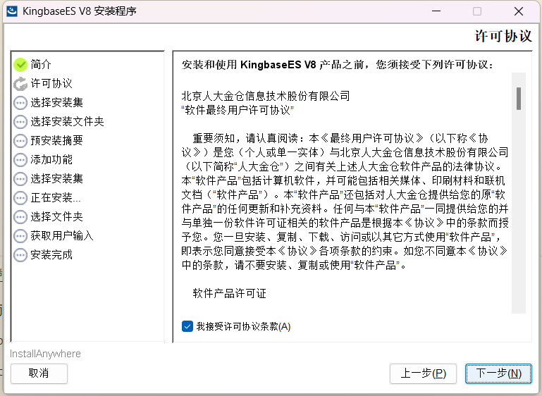
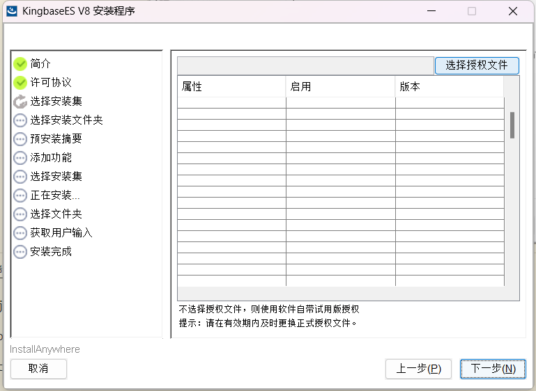
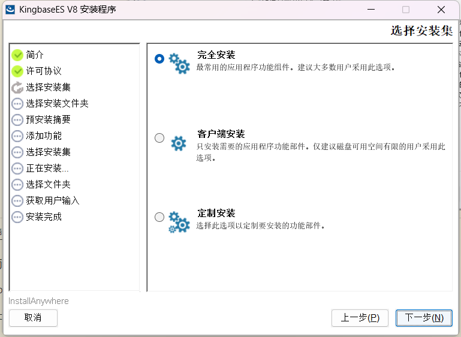
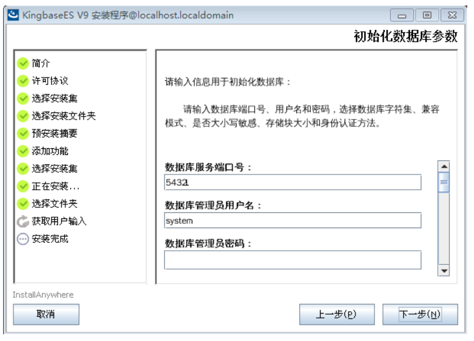
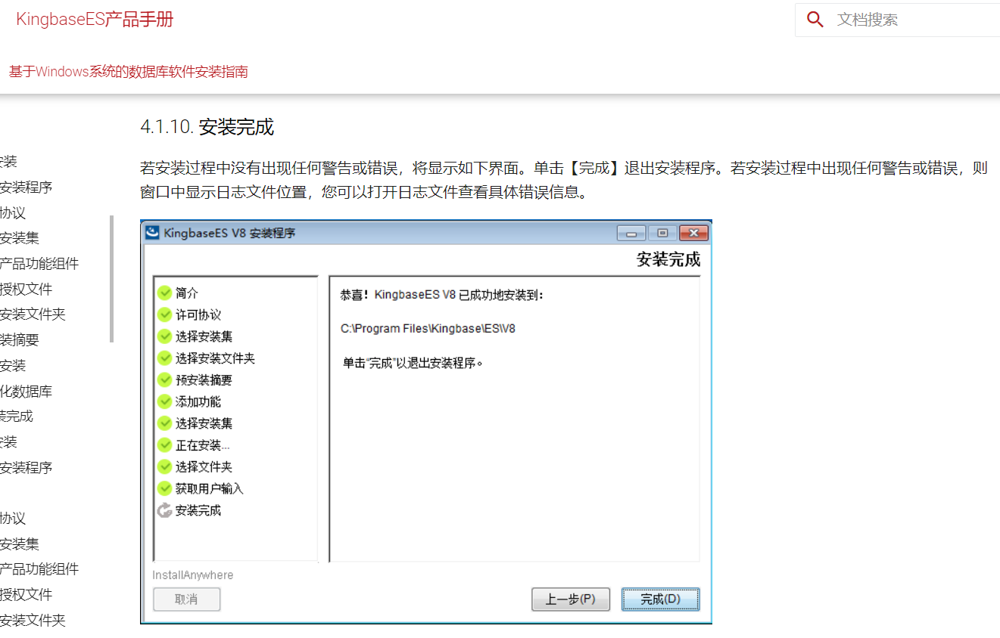

# 金仓数据库环境配置

本节旨在详细阐述金仓数据库的环境配置流程，涵盖了从安装金仓数据库、操作数据库，到使用数据库连接工具 Navicat 连接数据库的全方位说明。

## 本节目录

- [金仓数据库环境配置](#金仓数据库环境配置)
  - [本节目录](#本节目录)
  - [安装金仓数据库](#安装金仓数据库)
    - [下载安装包](#下载安装包)
      - [有课程资料包](#有课程资料包)
      - [无课程资料包](#无课程资料包)
    - [使用安装包](#使用安装包)
      - [图形化安装](#图形化安装)
      - [命令行安装](#命令行安装)
    - [完成标志](#完成标志)
  - [强调项](#强调项)

## 安装金仓数据库

以下内容将介绍如何在 Windows 系统上进行金仓数据库的图形化安装。若您倾向于使用命令行安装，请参阅官方文档以获取详细步骤。

**PS：我使用的金仓数据库版本为 V8R6。**

### 下载安装包

#### 有课程资料包

在的课程资料包中，`安装数据库` 文件夹内包含了一个以 `.iso` 为扩展名的文件。双击此文件以打开，其内部有一个名为 `KINGBASE.EXE` 的安装程序。

#### 无课程资料包

若未获得课程资料包，可访问金仓数据库官方网站以下载安装包：[金仓数据库官方下载](https://download.kingbase.com.cn/xzzx/index.htm)

### 使用安装包

#### 图形化安装

以下是基于图形界面的安装步骤。若在安装过程中遇到任何错误，请参考金仓官方手册：[金仓数据库 Windows 安装指南](https://bbs.kingbase.com.cn/kingbase-doc/v9/install-updata/install-windows/install-windows-8.html#id4)

我们将逐步解析安装过程：

在安装之前，请先保证系统某一磁盘(单一磁盘！)的剩余空间大于 12GB，否则安装程序会拒绝安装。

1. 运行 `KINGBASE.EXE`，等待其解压完成后自动开始安装。
2. 遵循安装向导的指示完成安装。部分情况下，可能会让选择 `实例管理`，推荐选择 `新的实例`。
   1. 在打开的窗口中，先同意许可证，然后点击 `下一步`：
      
   2. 然后选择许可协议。点击右侧的 `选择授权文件` 后：
      
      - 对于有课程资料包的用户，请选择课程资料包里面的 `安装数据库` 目录下的名叫 `license_***` 的目录，里面有一个名字类似 `license_***.dat` 的文件，选择该文件后，点击 `下一步`。
      - 对于无课程资料包的用户，请在官网上下载到 `license.dat` 文件，然后选择该文件，点击 `下一步`。
   3. 在`选择安装集`时，选择`完全安装`，之后点击`下一步`：
      
   4. 在`选择安装目录`时，选择一个合适的目录进行安装，需要保证该目录隶属的磁盘有超过 12G 的剩余空间，否则会直接安装失败！
   5. 之后一直选择`下一步`，直到 `获取用户输入` 部分。此部分我们需要进行一系列配置(其它参数不用动)：
      
      - 端口号配置：54321
      - 管理员用户名：system
      - 密码我们选择简单的 `123456`
      - 确认密码：`123456`
      - 编码：`GBK`
      - 兼容模式：`MySQL`
      - 大小写敏感：`NO`
   6. 最后，点击 `下一步`并稍作等待，程序即可完成安装。
   7. 如果过程中，出现提示说 `发生问题`，则请使用**安装后自带的卸载工具**将数据库卸载干净，然后重新安装。

#### 命令行安装

对于命令行安装，请参照以下官方手册进行：

- Windows 版：[金仓数据库 Windows 命令行安装指南](https://bbs.kingbase.com.cn/kingbase-doc/v9/install-updata/install-windows/index.html)
- Linux 版：[金仓数据库 Linux 命令行安装指南](https://bbs.kingbase.com.cn/kingbase-doc/v9/install-updata/install-linux/index.html)

### 完成标志

如官方手册所示：

## 强调项

由于作者在安装过程中并没有出现错误，故如果过程出现报错，请参考官方手册的 [QA 部分](https://bbs.kingbase.com.cn/kingbase-doc/v9/install-updata/install-windows/install-windows-8.html#id4)。

**PS：有时候简单的重来也`可能`能够解决问题，但注意，重来之前务必把之前的内容删干净，且重来时选择 `新的实例`！**
