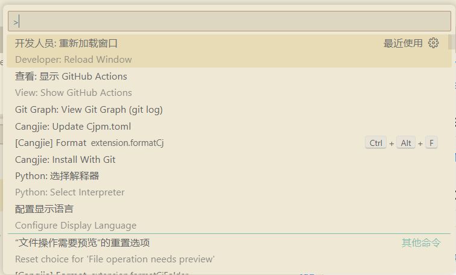
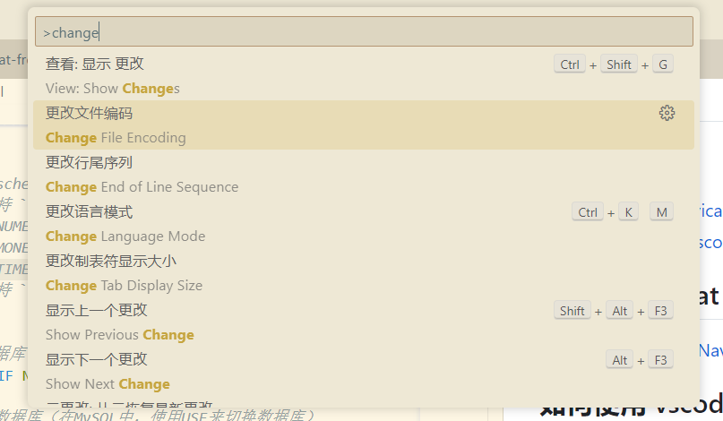
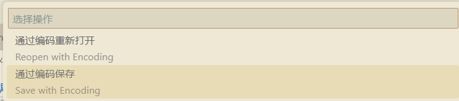
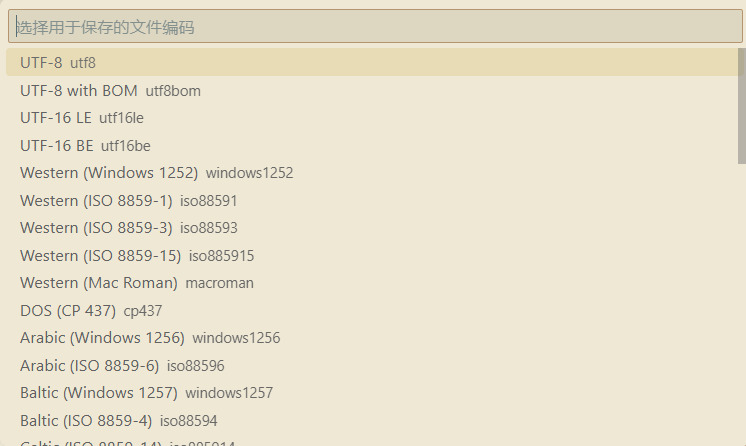

# Q & A

## 本节目录

- [Q \& A](#q--a)
  - [本节目录](#本节目录)
  - [如何在 Navicat 里看 ER 图？](#如何在-navicat-里看-er-图)
  - [如何使用 vscode 调整文件编码？](#如何使用-vscode-调整文件编码)

## 如何在 Navicat 里看 ER 图？

> 博客链接：
> [使用 Navicat 生成 ER 关系图并导出](https://www.cnblogs.com/kirin1105916774/p/11179132.html)

## 如何使用 vscode 调整文件编码？

以将文档编码改为 UTF-8 为例：

1. 使用 vscode 打开文件

2. 按下 `ctrl + shift + p` 打开命令面板
   
3. 输入 `Change File Encoding` 选择 `Change File Encoding`
   
4. 选择 `Save with encoding`
   
5. 输入 `UTF-8` 选择 `Convert to UTF-8`
   
